 

 

Welcome to my Chrome Extension Collection GitHub repository! This repository is a curated list of Chrome extensions that I personally use and find useful for enhancing productivity, security, and overall browsing experience. Whether you're a casual user or a power user, you'll find a variety of extensions here to cater to your needs.

## Overview

In this collection, you'll find a diverse range of Chrome extensions covering various categories, including:

- **Privacy & Security**
- **Web Development & Analysis**
- **Learning & Productivity**

## Included Extensions

### Privacy & Security:
- [TempMail](https://chromewebstore.google.com/detail/temp-mail-disposable-temp/inojafojbhdpnehkhhfjalgjjobnhomj): Provides temporary email addresses to protect your privacy and reduce spam.
- [Kill Switch](https://chromewebstore.google.com/detail/kill-switch/gojllalahpiahalfhfjpbpfhjpaahjkc): Blocks specific websites based on IP addresses, enhancing security when using VPNs.
- [Cookie Editor](https://chromewebstore.google.com/detail/cookie-editor/hlkenndednhfkekhgcdicdfddnkalmdm): Powerful tool for viewing, editing, and managing browser cookies for privacy and pentesting.

### Web Development & Analysis:
- [Wappalyzer](https://chromewebstore.google.com/detail/wappalyzer-technology-pro/gppongmhjkpfnbhagpmjfkannfbllamg): Identifies technologies and frameworks used on websites for reconnaissance.
- [EndPointer](https://github.com/AtlasWiki/EndPointer): Discovers potentially vulnerable endpoints on webpages and in linked JavaScript files.
- [DOMLogger++](https://chromewebstore.google.com/detail/domlogger++/lkpfjhmpbmpflldmdpdoabimdbaclolp): Tracks DOM modifications and logs interactions for deeper web analysis.
- [Simple Proxy Switcher](https://chromewebstore.google.com/detail/simple-proxy-switcher/pcboajngloecgmaailkmphmpbacmbcfb): Easy-to-use proxy switcher for web development, testing, and bypassing restrictions.
- [Json & Code Viewer](https://chromewebstore.google.com/detail/json-code-viewer/miahlkanimkomfiiecemmdmjgenckamn): Performs syntax highlighting on files visited in the browser based on their extension
- [ReCaptcha Solver](https://chromewebstore.google.com/detail/rektcaptcha-recaptcha-sol/bbdhfoclddncoaomddgkaaphcnddbpdh): Assists in bypassing reCAPTCHA challenges for testing purposes.
- [PostMessage Tracker](https://github.com/fransr/postMessage-tracker): Monitors and tracks PostMessage communications between websites for security testing.
- [JWT Debugger](https://github.com/Hacking-Notes/jwt): Enables testing and analysis of JSON Web Tokens in your browser session.
- [Time Travel](https://chromewebstore.google.com/detail/time-travel/jfdbpgcmmenmelcghpbbkldkcfiejcjg): Allows you to change your browser's default date for testing edge cases and time-sensitive features.
- [CSPT Detector](soon): Identifies and helps you test for Cross-Site Request Forgery vulnerabilities.

### Learning & Productivity:
- [Global Speed](https://chromewebstore.google.com/detail/global-speed/jpbjcnkcffbooppibceonlgknpkniiff): Accelerates learning by adjusting video and audio playback speed across various platforms.
- [Speechify](https://chromewebstore.google.com/detail/speechify-text-to-speech/ljflmlehinmoeknoonhibbjpldiijjmm): Text-to-speech tool that converts written content to audio for efficient multitasking.

## 🧰 Hacking Notes Ecosystem

🌐 &nbsp;**[hacking-notes.com](https://hacking-notes.com)** &nbsp;·&nbsp; ✍️ &nbsp;**[blog](https://hacking-notes.medium.com/)** &nbsp;·&nbsp; 💬 &nbsp;**[discord](https://discord.gg/r68ameNHrD)**

| | Resource | What you get |
| :-: | -------- | ------------ |
| 🗺 | **[Hacker-Roadmap](https://github.com/Hacking-Notes/Hacker-Roadmap)** | Structured paths from beginner to pro — hobbyist, bug bounty, certs & degree. |
| 🔴 | **[RedTeam Notes](https://github.com/Hacking-Notes/RedTeam)** | Offensive security notes: recon, exploitation, Windows & Linux. |
| 🔷 | **[BlueTeam Notes](https://github.com/Hacking-Notes/BlueTeam)** | Defensive security notes: forensics, malware, log & packet analysis. |
| 🧩 | **[Extensions](https://github.com/Hacking-Notes/Extensions)** | Curated Chrome extensions for ethical hacking & recon. |
| 🔖 | **[Bookmarks](https://github.com/Hacking-Notes/Bookmarks)** | Curated hacker bookmark collection, one import away. |

<a href="#top">⬆ back to top</a>

